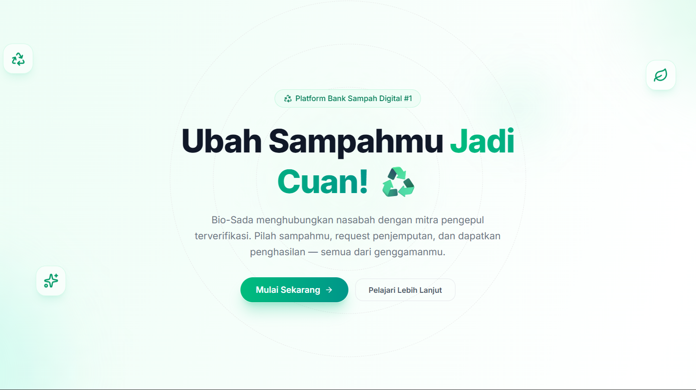

<div align="center">
  
  
  # 🌿 Bio-Sada
  ### Digital Waste Bank Platform for Sustainable Future
  
  [](https://vitejs.dev/)
  [](https://reactjs.org/)
  [](https://tailwindcss.com/)
  [](https://supabase.io/)
  [](https://www.typescriptlang.org/)
</div>

---

## 📖 Overview

**Bio-Sada** adalah platform Bank Sampah Digital yang menghubungkan tiga entitas utama: **Nasabah (Customers)**, **Mitra/Pengepul (Partners)**, dan **Admin**. Fokus utamanya adalah mendigitalisasi proses setoran sampah, memberikan transparansi harga, dan mempermudah logistik penjemputan sampah di area Malang dan sekitarnya.

Platform ini dirancang dengan pendekatan *mobile-first* untuk memastikan kemudahan akses bagi semua lapisan masyarakat dalam berkontribusi pada kebersihan lingkungan.

## 🚀 Key Features

### 👤 Nasabah (Customers)
- **Request Penjemputan:** Mengajukan penjemputan sampah dengan estimasi berat.
- **Katalog Sampah:** Informasi harga sampah terkini yang transparan.
- **Riwayat Setoran:** Pantau semua transaksi dan total tabungan sampah.
- **Profil Digital:** Kelola data diri dan lokasi penjemputan.

### 🤝 Mitra (Partners)
- **Dashboard Real-time:** Notifikasi instan saat ada permintaan penjemputan masuk.
- **Manajemen Tugas:** Ambil dan kelola tugas penjemputan secara efisien.
- **Validasi Berat:** Input berat asli di lokasi untuk kalkulasi otomatis.
- **Laporan Transaksi:** Rekapitulasi penghasilan dan performa harian/bulanan.

### 🔑 Admin
- **Verifikasi Mitra:** Validasi pendaftaran mitra baru untuk menjamin kualitas layanan.
- **Manajemen User:** Kelola database nasabah dan mitra secara terpusat.
- **Monitoring Transaksi:** Pantau seluruh alur logistik dan finansial platform.
- **Master Data:** Update harga sampah dan kategori secara dinamis.

## 🛠️ Tech Stack

- **Frontend:** React.js (Vite) + TypeScript
- **Styling:** Tailwind CSS v4 (Standard terbaru, CSS-first)
- **UI Components:** shadcn/ui (Radix UI + Lucide Icons)
- **State Management:** Zustand
- **Data Fetching:** TanStack Query v5
- **Backend:** Supabase (Auth, PostgreSQL, Real-time, Storage)
- **Notifications:** OneSignal & Sonner

## 🏗️ Project Structure

```bash
src/
├── components/     # UI Components (shadcn/ui & shared)
├── hooks/          # Custom React Hooks
├── lib/            # Utilities (Supabase client, Image Compression)
├── pages/          # Page Components (Auth, Dashboard, Landing)
├── stores/         # Zustand Stores (Auth, Global State)
├── types/          # TypeScript Definitions
└── App.tsx         # Main Routing & App Logic
```

## ⚙️ Getting Started

### Prerequisites
- Node.js (Latest LTS recommended)
- Supabase Project (Database & Auth)

### Installation

1. Clone the repository:
   ```bash
   git clone https://github.com/your-username/bio-sada.git
   ```

2. Install dependencies:
   ```bash
   npm install
   ```

3. Setup environment variables (`.env.local`):
   ```env
   VITE_SUPABASE_URL=your_supabase_url
   VITE_SUPABASE_ANON_KEY=your_supabase_anon_key
   VITE_ONESIGNAL_APP_ID=your_onesignal_id
   ```

4. Run development server:
   ```bash
   npm run dev
   ```

---

<div align="center">
  Developed with ❤️ by <b>Bafdev</b>
</div>
